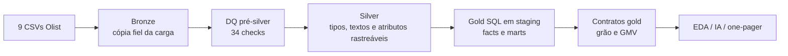
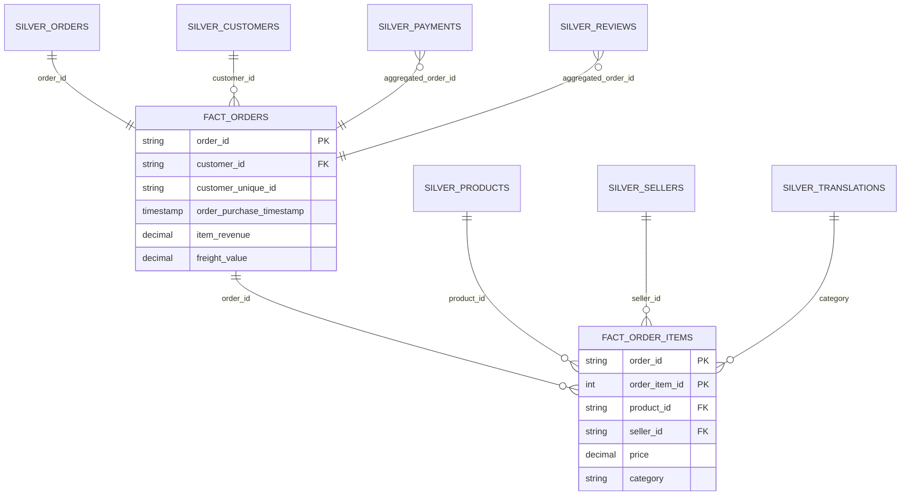

# Case Analytics Engineer Sênior — iFood / Olist

Resposta enxuta ao desafio: **quais alavancas podem aumentar o GMV nos próximos seis meses?** O repositório transforma os nove CSVs Olist em dados bronze–silver–gold, valida qualidade antes da transformação, responde às cinco perguntas analíticas e registra três recomendações executivas. A amostra é histórica (2016–2018); os impactos são cenários sobre o último período completo observado, não previsões do iFood atual.

## Resultado executivo

- As cinco categorias líderes representam **40,8%** do GMV de março–agosto/2018. Um uplift conservador de 3% nesse grupo equivale a **R$ 68,1 mil (+1,23%)**.
- SP, RJ e MG concentram **R$ 3,57 mi (64,2%)** no mesmo período. Um teste com +1% de GMV equivale a **R$ 35,7 mil (+0,64%)**.
- Atrasos atingem **8,8%** das entregas elegíveis; nota média cai de **4,29 para 2,57** e recompra observada de **3,31% para 2,72%**. O bootstrap por cliente estima diferença de **−0,59 p.p.** (IC95%: −0,97 a −0,20 p.p.), mas a análise com janela uniforme de 90 dias cruza zero. R$ 490,5 mil de GMV passaram por pedidos atrasados no recorte; reduzir 25% dos atrasos trata **R$ 122,6 mil de GMV sob exposição logística**, sem assumir que esse valor se torna receita incremental.

Detalhes, plano de seis meses e riscos: [one-pager executivo](docs/one_pager.md). A explicação de cada script e bloco lógico está na [referência técnica](docs/code_reference.md), complementada por docstrings e comentários no próprio código.

## Como executar do zero

Requer Python 3.11+. Baixe os nove CSVs do dataset Olist em uma única pasta.

```powershell
python -m venv .venv
.venv\Scripts\Activate.ps1
pip install -r requirements.lock
$env:PYTHONPATH = "src"
$env:OLIST_SOURCE = "C:\caminho\archive"

# Diagnóstico da origem antes de transformá-la.
jupyter notebook notebooks\01_data_quality.ipynb

# Medalhão + checks críticos + contratos pós-gold.
python -m ifood_analytics.pipeline --source "C:\caminho\archive" --data data

# EDA, resumo opcional e testes de contrato.
jupyter notebook notebooks\02_exploratory_analysis.ipynb
python -m ifood_analytics.ai_summary --data data
python -m pytest
```

`requirements.txt` mantém faixas compatíveis; `requirements.lock` fixa as versões diretas de referência para reprodução do case. Os notebooks localizam a raiz do projeto tanto quando abertos a partir da raiz quanto de `notebooks/`. Os outputs ficam em `data/` (ignorado no Git), inclusive `data/reports/data_quality.json` e `pipeline_manifest.json`.

## Ordem de análise e decisões

1. [`01_data_quality.ipynb`](notebooks/01_data_quality.ipynb): inspeciona diretamente a origem antes das transformações: schema, grão, nulos, FKs, domínio, outliers, datas, reconciliação e geografia.
2. [`pipeline.py`](src/ifood_analytics/pipeline.py): materializa bronze, executa o gate de DQ, gera silver e publica gold por staging.
3. [`02_exploratory_analysis.ipynb`](notebooks/02_exploratory_analysis.ipynb): consulta a gold com pandas e SQL DuckDB para responder às cinco perguntas e testar a robustez das conclusões.

Decisões principais:

- Nenhuma linha dos nove CSVs é excluída na bronze ou na silver detalhada; o manifesto audita diferenças de contagem iguais a zero.
- Nulos de entrega são preservados quando o status não implica entrega; o pipeline não inventa datas.
- Categoria ausente (1,85%) ganha a flag `is_category_missing` e o valor analítico `unknown`, impedindo perda de GMV sem ocultar a ausência original.
- Geolocalização detalhada mantém 1.000.163 registros; `geolocation_by_zip` é uma tabela adicional com 19.015 CEPs por mediana/moda segura, nunca um substituto da fonte.
- Reviews sem comentário são válidos; o score continua utilizável.
- Pagamentos e reviews são agregados por pedido antes dos joins com itens, evitando fan-out e duplicação de GMV.
- O DQ valida schema das nove fontes, sete chaves de grão/dimensão, integridade referencial e reconciliação completa via `outer join`. Na execução de referência, há três warnings explícitos: extremos, 29 coordenadas fora da faixa e divergências de reconciliação.
- A gold só é publicada após materializar todas as seis relações em staging e validar grão/reconciliação pós-join.
- **GMV** é a soma de `price` de pedidos que não estão `canceled`/`unavailable`; não é receita contábil líquida, pois custo, margem, comissão e subsídio não existem na fonte. Frete é separado.
- “Rentabilidade” é usada apenas como proxy de GMV; CLV é GMV histórico observado por cliente, não previsão de valor futuro.

## Arquitetura e modelo





`fact_orders` tem uma linha por pedido e é segura para GMV/AOV/CLV. `fact_order_items` tem uma linha por item e atende categoria/seller. Pagamentos e reviews são agregados por pedido antes do join; as métricas de review e atraso nos marts de categoria/seller são ponderadas por item, o que é apropriado para essas visões de item, mas não equivale à média por pedido. A geolocalização detalhada e sua visão por CEP ficam na silver, pois as perguntas usam UF de customers/sellers.

## Estrutura e responsabilidades

| Componente | Responsabilidade |
|---|---|
| `config.py` | Contrato dos nove arquivos e caminhos das camadas |
| `quality.py` | Schema, chaves, FKs, domínio, datas, outliers e reconciliação; produz relatório JSON |
| `pipeline.py` | Orquestra bronze, gate de DQ, silver, gold por staging, contratos pós-gold e manifesto |
| `gold.sql` | Define grãos, joins seguros, semântica de GMV e marts analíticos |
| `analysis.py` | Bootstrap simples e bootstrap agrupado por cliente para o EDA |
| `ai_summary.py` | Resumo agregado com fallback local e validação da gold |
| `tests/` | Seis testes rápidos de integração, DQ e robustez da IA |
| `01_data_quality.ipynb` | Diagnóstico anterior aos tratamentos e auditoria de preservação |
| `02_exploratory_analysis.ipynb` | Cinco perguntas de negócio e análises de robustez |
| `docs/` | One-pager, relatórios de referência e documentação de código |

## Automação com IA

`ai_summary.py` envia ao LLM somente métricas agregadas de três marts; nunca IDs de cliente, pedidos ou comentários. Sem `OPENAI_API_KEY`, produz fallback determinístico. Se a gold estiver ausente, vazia ou com schema incompatível, o script falha cedo com instrução acionável. Com a chave, usa a Responses API e `OPENAI_MODEL` configurável. O resultado é um rascunho executivo a revisar por uma pessoa, não uma decisão automatizada.

## Limitações conhecidas

- Base histórica e anonimizada: hipóteses precisam ser revalidadas em dados atuais do iFood.
- Setembro/outubro de 2018 são residuais; o recorte executivo usa março–agosto, seis meses de calendário completos.
- A associação entre atraso e recompra não prova causalidade. O resultado de 90 dias é inconclusivo, portanto a ação proposta é um experimento controlado.
- GMV não representa receita líquida nem margem. Conversão, custo de aquisição, estoque/ruptura e margem precisam ser instrumentados.
- Pedidos `canceled`/`unavailable` ficam fora apenas dos marts comerciais; bronze, silver e facts os preservam para auditoria e análises de processo.
